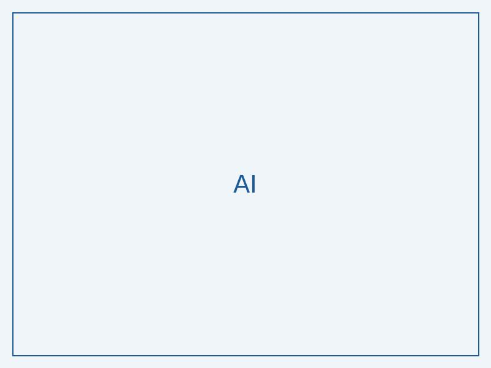

# LinkedIn Post Draft 1

Generated: 2025-05-22 12:27:09

Source: research - The Atlas of In-Context Learning: How Attention Heads Shape In-Context
  Retrieval Augmentation

## Content

"Unlocking the Secrets of AI's External Knowledge 🤯"

Ever wondered how AI can access knowledge beyond its training data? 🤔 Researchers from Patrick Kahardipraja, Reduan Achtibat, and Thomas Wiegand et al. have made a groundbreaking discovery! 🎉

Their study, "The Atlas of In-Context Learning," reveals the hidden mechanisms of "retrieval-augmentation," where large language models can tap into external knowledge" through specialized attention heads. 🔍 These heads are like super-powered librarians, comprehending instructions and retrieving relevant information from the context! 📚

The researchers developed an innovative method to identify and analyze these attention heads, showing how they influence the answer generation process. They even extracted "function vectors" to modify attention weights and understand their roles! 🔧

This research matters because it can lead to safer and more trustworthy language models. By tracing the sources of knowledge used during inference, we can ensure that AI decisions are transparent and reliable. 💡

So, what's next? How can we further harness the power of retrieval-augmentation to unlock new possibilities in AI? 🤔

Read the full paper here: http://arxiv.org/abs/2505.15807v1

Tagging: @Patrick Kahardipraja, @Reduan Achtibat, @Thomas Wiegand et al.

Image prompt: A diagram showing the architecture of the Atlas of In-Context Learning model, with attention heads and function vectors illustrated.

Original source: http://arxiv.org/abs/2505.15807v1
