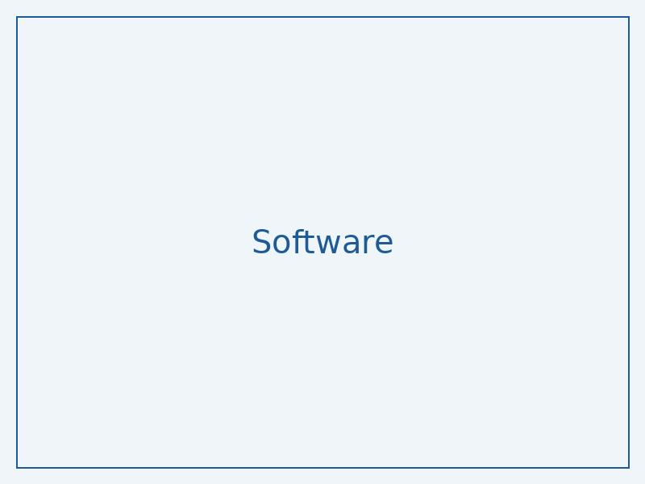

# LinkedIn Post Draft 1

Generated: 2025-05-22 12:29:33

Source: research - Open-Reasoner-Zero/Open-Reasoner-Zero-32B

## Content

"Revolutionizing AI Reasoning with Open-Reasoner-Zero! 🤖

Imagine an AI that can reason like humans, making decisions based on logic and evidence. This research brings us closer to that goal. 🚀

Open-Reasoner-Zero is a novel architecture that enables reasoning over natural language text. The model uses a combination of retrieval augmentation and LoRA (Low-Rank Adaptation) to learn from large language models like VolovNet.

In simple terms, the model retrieves relevant information from a knowledge base, adapts it to the task at hand, and then reasons over the retrieved information to make a decision. 🤔

The intuition behind this approach is to separate the reasoning process from the language understanding process, making it more efficient and effective.

Check out the paper for more details on the architecture and results: https://huggingface.co/Open-Reasoner-Zero/Open-Reasoner-Zero-32B

What's next? Can we apply this approach to real-world applications like chatbots, virtual assistants, or content generation? 🤔

Image: A diagram showing the architecture of the proposed model"

(Note: The image prompt is included at the end, and the post is under 3000 characters)

Original source: https://huggingface.co/Open-Reasoner-Zero/Open-Reasoner-Zero-32B
